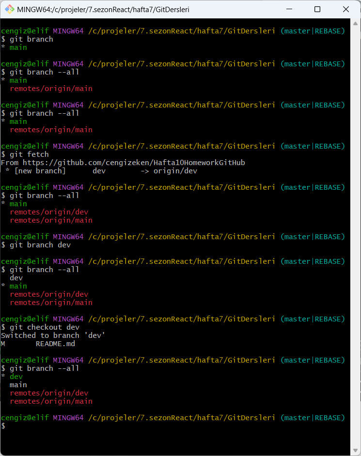

# Hafta10 Homework GitHub

10.hafta ödevi;Git-Github

Türkçe Git Dersleri linki: https://www.youtube.com/watch?v=O3KtLRmp5q4&list=PLld6WWpFK1nEhFvvYi5ts-_JoUL3wF3zz

İngilizce Git Dersleri linki: https://www.youtube.com/watch?v=3RjQznt-8kE&list=PL4cUxeGkcC9goXbgTDQ0n_4TBzOO0ocPR

##Branching
git branch --all
github tarafında dev isimli bir branch oluştur ve
git fetch komutu ile bu branch ı lokale çek. sonra git branch -all komutu ile
remote da oluşturulan dev branch ının geldiğini gör
git branch dev komutu ile lokalde de bir dev branch ı oluştur. Komut ekranında yeşil olan main branch, ana branch olduğundan yeşil görünüyor

Branching kısmı ile ilgili olan değişiklikler dev branchı altında yer alacak
